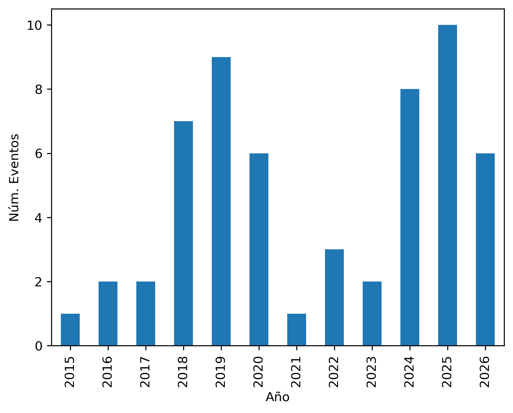
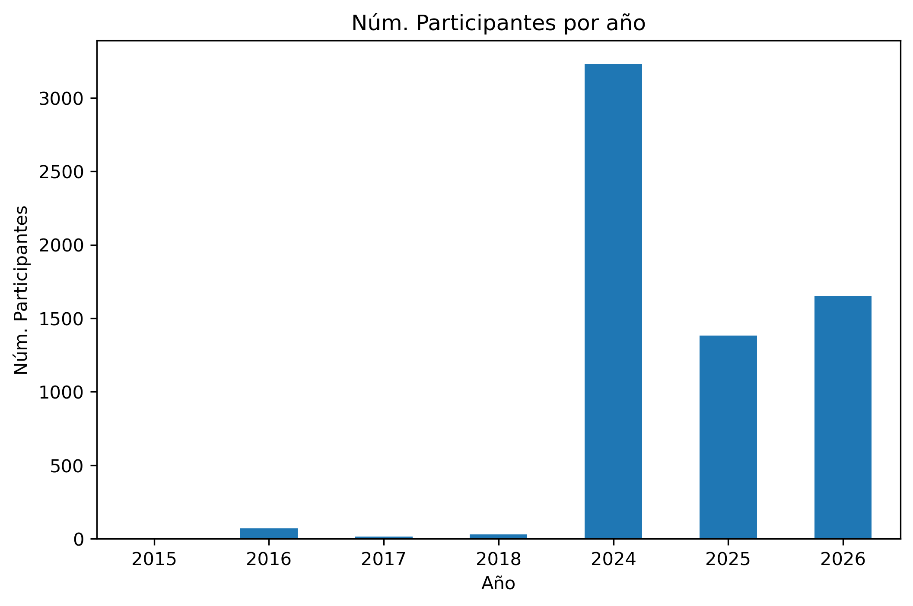
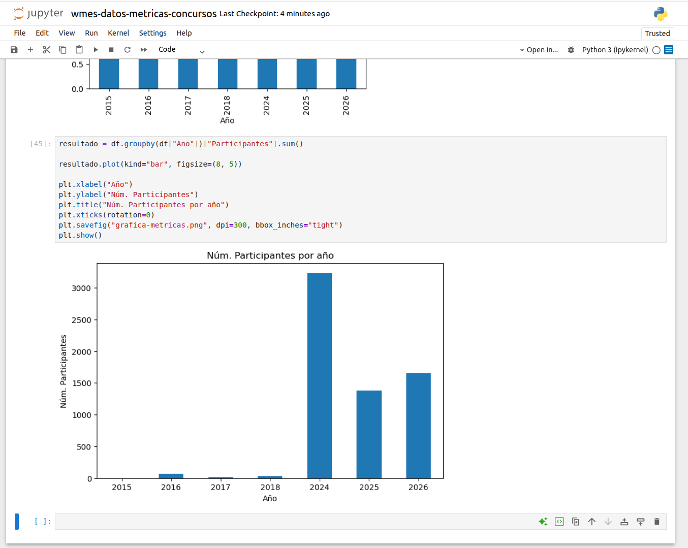

# wmes-glam-analisis

Este proyecto tiene como objetivo el análisis de las actividades realizadas en [Wikimedia España](https://wikimedia.es/). 

## Introducción
Se ha recopilado una [colección de eventos](GLAM-WMES-Actividades.csv) y se proporciona como datos para su extensión, enriquecimiento y reutilización. A modo de ejemplo, se incluye una colección de Jupyter Notebooks que muestra cómo reutilizar los datos generados.

El código es posible ejecutarlo en un navegador utilizando el icono Binder incluido al inicio de este documento.

## Autores

- Ángel Obregón - Universidad Internacional de la Rioja
- Rubén Ojeda - Wikimedia España
- Gustavo Candela - Universidad de Alicante

Agradecemos el trabajo realizado por parte de todos los socios de Wikimedia España.

## Licencia
 Content is licensed under a <a rel="license" href="http://creativecommons.org/licenses/by/4.0/">Creative Commons Attribution 4.0 International license</a>.
